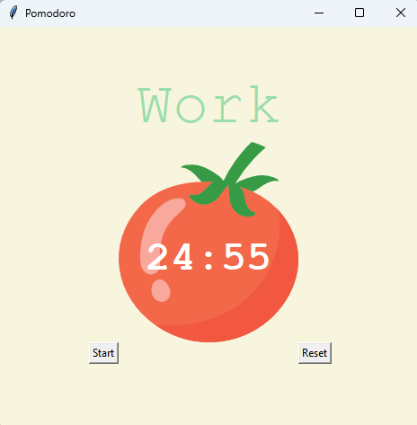

# 🍅 Pomodoro Timer

Egy egyszerű, de hatékony Pomodoro időzítő alkalmazás Python és Tkinter használatával. Ez az alkalmazás segít a produktivitás növelésében a Pomodoro Technika alkalmazásával.



## 📋 Jellemzők

- 25 perces munka intervallumok
- 5 perces rövid szünetek
- 20 perces hosszú szünetek minden 4. ciklus után
- Vizuális visszajelzés a munkafolyamatról
- Egyszerű és intuitív felhasználói felület
- Visszaállítható időzítő

## 🛠 Technikai Követelmények

- Python 3.x
- Tkinter (általában a Python alapértelmezett telepítésének része)
- tomato.png fájl (az alkalmazás könyvtárában kell lennie)

## 🚀 Telepítés

1. Klónozza le a repository-t:
```bash
git clone [repository-url]
```

2. Navigáljon a projekt könyvtárába:
```bash
cd pomodoro-timer
```

3. Győződjön meg róla, hogy a `tomato.png` fájl megtalálható a projekt gyökérkönyvtárában.

## 💻 Használat

1. Indítsa el a programot:
```bash
python main.py
```

2. Az alkalmazás kezelése:
   - Kattintson a "Start" gombra a időzítő elindításához
   - A "Reset" gomb visszaállítja az időzítőt
   - A pipák (✔) jelzik a befejezett munkaperiódusokat

## 🎨 Testreszabás

A konstansok módosításával személyre szabhatja az időzítőt:

```python
WORK_MIN = 25        # Munka intervallum hossza
SHORT_BREAK_MIN = 5  # Rövid szünet hossza
LONG_BREAK_MIN = 20  # Hosszú szünet hossza
```

## 🎯 Hogyan működik

1. **Munka Fázis**: 25 perces koncentrált munka
2. **Rövid Szünet**: 5 perces pihenő
3. **Ismétlés**: 4 munka/szünet ciklus után
4. **Hosszú Szünet**: 20 perces pihenő a 4. ciklus után

## 🎨 Színséma

- 🟢 Zöld (#9bdeac): Munka fázis jelzése
- 🔴 Piros (#e7305b): Hosszú szünet jelzése
- 🌸 Rózsaszín (#e2979c): Rövid szünet jelzése
- 🟡 Sárga (#f7f5dd): Háttérszín

## 📝 Megjegyzések

- Az alkalmazás automatikusan váltogat a munka és szünet fázisok között
- A pipák számolják a befejezett munkaperiódusokat
- A Reset gomb törli az összes előzményt

## 🤝 Közreműködés

Ha szeretne hozzájárulni a projekthez:

1. Fork-olja a repository-t
2. Hozzon létre egy új branch-et
3. Commitolja a változtatásait
4. Nyisson egy Pull Request-et

## 📜 Licenc

[MIT License](LICENSE)
